# Development Log

---

## Date: 19/03

**Initial Project Setup**

- Designed submarine map layout with many interconnected rooms.
- Implemented Room class with directional links and item storage.

---

## Date: 22/03

**Movement Buttons**

- Added several UI button placeholders
- Added movement buttons that allow the player to move between rooms

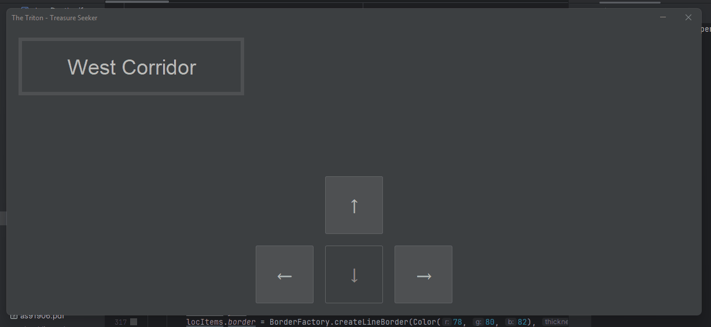

---

## Date: 02/04

**GUI Implementation**

- Added oxygen bar using overlays (blue bg + grey fg).
- Added rooms updating with titles and descriptions

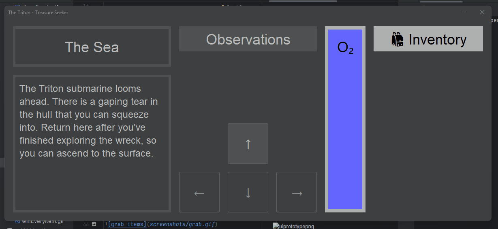

---

## Date: 05/04

**Grabbing Items**
- Added items to rooms
- Items can be grabbed using grab button

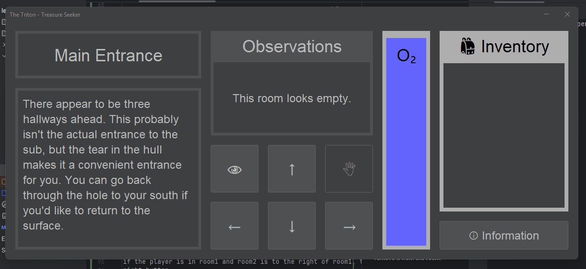

---

## Date: 

**Searching rooms**

- Searching rooms reveals hidden contents
- Can only search a room when it has no items visible
- Can only search a room when it has not been searched

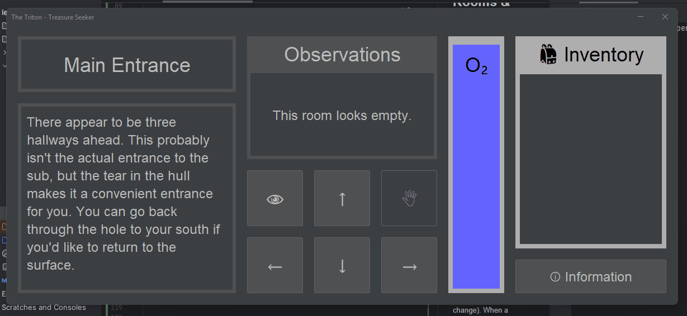

---

## Date: 12/04

**Special Items System & Inventory**

- Added items to rooms
- oxygen tank (refills O2) 
- key (unlocks Secure Storage)
- special ✪ items (tracked separately for winning)
- Added a way out item (not technically an item)

- **Bug**: Items wouldn't fit in the small inventory section
- **Fix**: Used `JScrollPane` to add a scroll bar.

Oxygen tank:
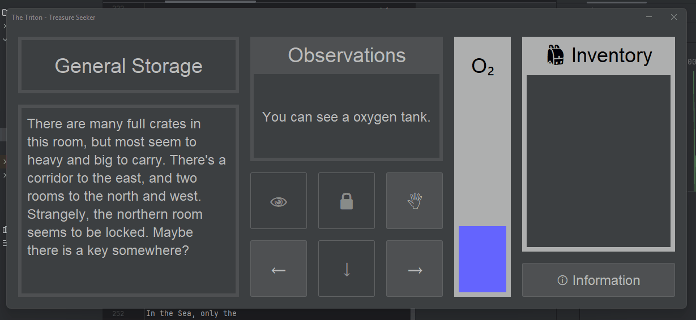

Scroll bar inventory:
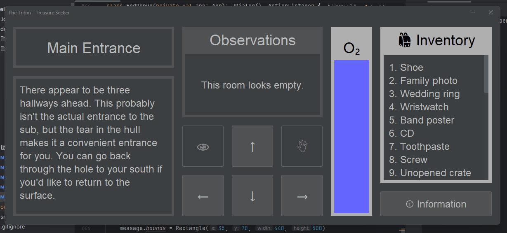  

---

## Date: 17/04

**Popup**

- Added tutorial popup with game mechanics summary.
- added an ending  popup that is for now unaccessible
- has different text depending on the ending, eg. winning or dying.

Tutorial popup:
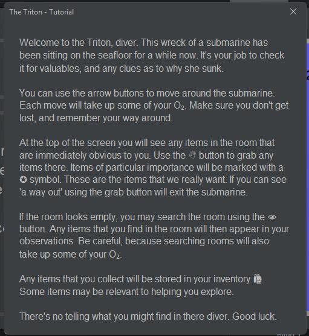

Death popup:
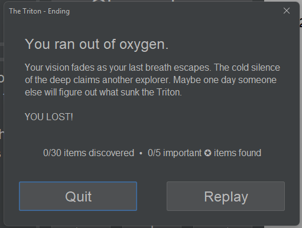

Submersible popup:
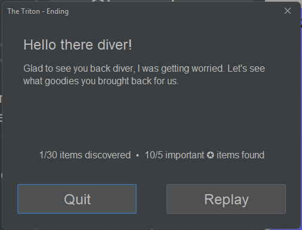

---

## Date: 26/04

**Win/Lose Conditions**

- Implemented several endings based on collected special items:
    - 0-2: Lose ("Not enough clues")
    - 3-4: Partial win ("Good effort")
    - 5: Full win ("Mystery solved!").

- **Bug**: Players important item inventory carried over even after they died
- **Fix**: Just reset it when the player replays

Losing with 0-2 items:
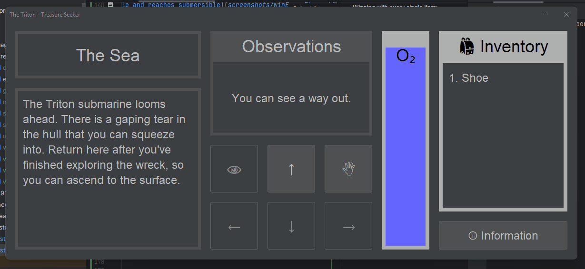

Winning with 3-4:
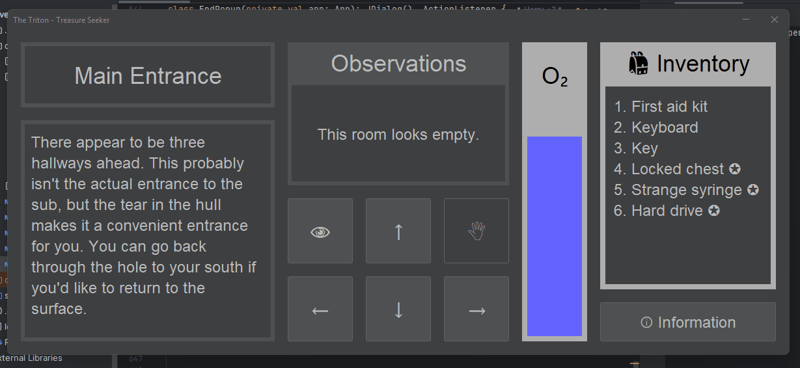

Winning with 5:
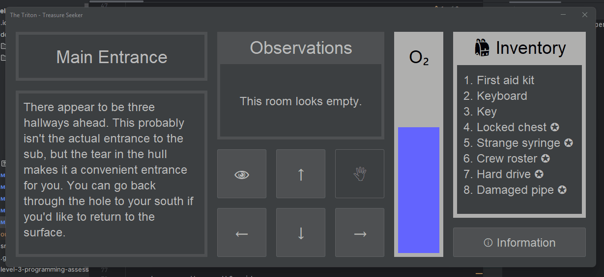

---

## Date: 02/05

**Polishing & Testing**

- Fixed a couple of rooms that were incorrectly linked
- Verified all 30 items could be collected.

  
