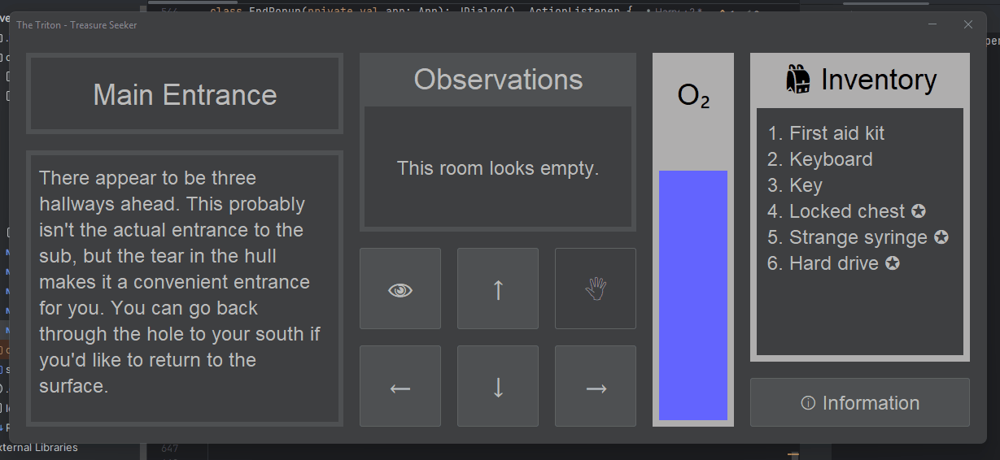
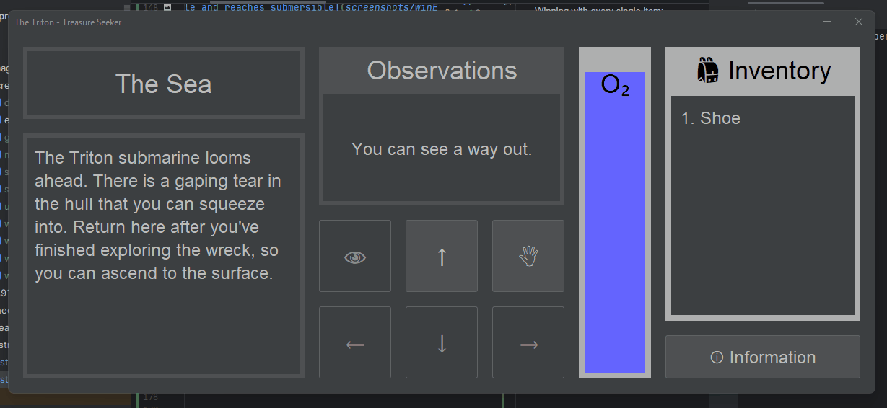

# Results of Testing

The test results show the actual outcome of the testing, following the [Test Plan](test-plan.md)

---

## Setting Up The Game

All the rooms and their contents should be instantiated as soon as the game is opened.
The player should always start in the room "The Sea" with no items in the inventory. When
the program is run it should open a popup explaining how to play the game.

### Test Data Used

Ran the program & checked that the tutorial opens & that the player spawns in "The Sea".

### Test Result

The rooms were instantiated & the player started in the room "The Sea". The tutorial popup opened upon running the program

---

## Moving Through The Map

This is to test that the player can move between different locations on the map. There are four main movement
buttons: up, down, left & right. The buttons should only be enabled if there is a room in that position. Eg.
if the player is in room1 and room2 is to the right of room1, the only movement button enabled would be the
right button.

### Test Data Used

In the Sea, only the
up button should be enabled. Main entrance is above the sea, and in that room all movement buttons should be
available. Next, to the right is the East Corridor. In that room, only the down button should be disabled.

### Test Result

The player movement works exactly as intended with the various movement buttons being enabled and disabled.

---

## UI Information Updating With Movement

As the player moves to different rooms, UI elements should change to reflect this.

### Test Data Used

The player starts in the room "The sea". When the game is started, It should say
"The sea" at the top of the screen, with a more interesting description below.
In the middle-top portion of the screen it will say what objects are directly
observable by the player. As the player moves through rooms, these aspects will
change to reflect what the room is and its contents. Additionally, with each move that
the player makes, the oxygen bar should deplete.

### Test Result

When the player was in "The Sea" the UI clearly communicated this to the player. Next, the player moved to the room "Main Entrance" and the UI also communicated this. With each room, the UI changed to reflect the details of the room accordingly as intended. When the player made the move, the oxygen bar lowered to show that some O2 was used.

---

## Grabbing Items & Inventory

Players can grab items using the grab button (🖑). Doing so will add the item to the
player's inventory & remove the item from the room. If there are no items in the
room the grab button should be disabled.

### Test Data Used

In the room "Main Entrance" the grab button should be disabled as there are no
immediately visible items.
In the room "Far E. Corridor" There is the item "wristwatch". Grabbing this item
should put the item into the inventory, and remove it from the room.

### Test Result

In the rooms where there were no items visible (such as Main Entrance), the grab button was disabled. However, in the room where there was an item visible (Far E. Corridor), the grab button was enabled. Grabbing an item resulted in it being added to the inventory and removed from the room. Working as intended.

---

## Searching Rooms & Visible Items

If a room does not have any immediately visible items, the player should be able
to search the room to reveal hidden items. Doing so will deplete some oxygen. Searching
a room can only be done if the room appears to be empty. When a room is searched,
if it has any contents they should be displayed in the visible items section.
If it has no hidden contents, the visible items section should say that the room
is empty (it should already say this & not change). When a player searches a room,
the search button should be permanently disabled for that room so that players won't
search it twice.

### Test Data Used

The Main Entrance room initially has no visible contents. Upon being searched,
it should display the item "shoe".
The room "West Corridor" initially has the item "Screw". Because there is an item
already visible to the player, the search button should be disabled. When the player
grabs the visible item, the search button should be enabled. Searching the room will
reveal any secret items, and the search button should now be permanently disabled for
that room regardless of if an item was revealed.

### Test Result

Searching the main entrance revealed the shoe item. Searching the West Corridor was initially disabled as there was already an item in that room. When the item was grabbed the search button was enabled. After searching both rooms, the search button was disabled permanently for both of those rooms (but not for all rooms).

---

## Winning The Game

In order to win the game, the player's goal is to find as many items in the wreck as
possible. There are 20 normal items, and 5 special items. The game can be won if
the player finds three or more special items, it is classed as a win. Additionally,
if the player attains every single item in the vessel there should be a special
message rewarding them.

### Test Data To Use

- Collect three special items (worst win scenario)
- Collect four special items (worst win scenario - same score as 3 items)
- Collect five special items (most common win scenario, and a a good score)
- Collect every single item (completionist win scenario that is fairly hard to attain)

### Test Result

Winning with 3 special items:

Winning with 4 special items:

Winning with all (5) special items:

Winning with every single item:

In all situations where the player had the correct items to win, the popup reflected this with unique dialogue for each unique win state. (3 & 4 items get the same dialogue as its classed as the same score)

---

## Dying & Losing The Game

If the player runs out of oxygen, they should die (thus they lose). Additionally,
if the player finds less than three important items in the wreckage and survives, they
still lose the game as they did not find enough valuable items.

### Test Data Used

Move around and search rooms until the oxygen runs out. When the oxygen runs out, it should
have a popup explaining that the player has died and ran out of oxygen.
Additionally, if the player returns with two or less important items they also lose the game.
If the player returns to the submersible with no items and most of their oxygen
left, the game assumes that they reentered by mistake. However, if they have
no items and little oxygen, they lose the game.

### Test Result

Player runs out of oxygen:

Player returns with little oxygen & nothing: (the reason that the player must have little oxygen for this loss is because if the player tries to leave with no items and most of their oxygen, this is most likely a mistake)

Player returns with at least 1 generic item but 0 important items: 

Player returns with less than 3 special items:

In all of these loss states, a unique popup appeared telling the player that the lost as intended. 

---

## Replaying Or Quitting

When the game has finished, either by the player dying or making it back to their own
submersible (and then either winning or losing based on their items) there will be a popup.
The popup will communicate to the player whether they won or lost and give them the
option to either replay the game or quit.

### Test Data Used

Quitting the game should close all windows & end the program.
Replaying should reset all room contents, place the player back at the starting location,
refill the oxygen & clear the inventory.
If the player has died, then closing the popup will just end the program, but if they
didn't die closing the popup will let them reenter the submarine to gather more items.

### Test Result

Quitting the game:

Replaying the game: (resets inventory & O2, location & room contents)

Closing death popup quits the program:

Closing submersible popup allows player to continue playing:

Both the quit & replay button work as intended. Closing the popup menu in the two different scenarios also functions as intended.

---

## Moving Through The Map

This is to test that the player can move between different locations on the map. There are four main movement
buttons: up, down, left & right. The buttons should only be enabled if there is a room in that position. Eg.
if the player is in room1 and room2 is to the right of room1, the only movement button enabled would be the
right button.

### Test Data Used

In the Sea, only the
up button should be enabled. Main entrance is above the sea, and in that room all movement buttons should be
available. Next, to the right is the East Corridor. In that room, only the down button should be disabled.

### Test Result

Comment on test result. Comment on test result. Comment on test result. Comment on test result. Comment on test result. Comment on test result.

---

## Moving Through The Map

This is to test that the player can move between different locations on the map. There are four main movement
buttons: up, down, left & right. The buttons should only be enabled if there is a room in that position. Eg.
if the player is in room1 and room2 is to the right of room1, the only movement button enabled would be the
right button.

### Test Data Used

In the Sea, only the
up button should be enabled. Main entrance is above the sea, and in that room all movement buttons should be
available. Next, to the right is the East Corridor. In that room, only the down button should be disabled.

### Test Result

Comment on test result. Comment on test result. Comment on test result. Comment on test result. Comment on test result. Comment on test result.

---

